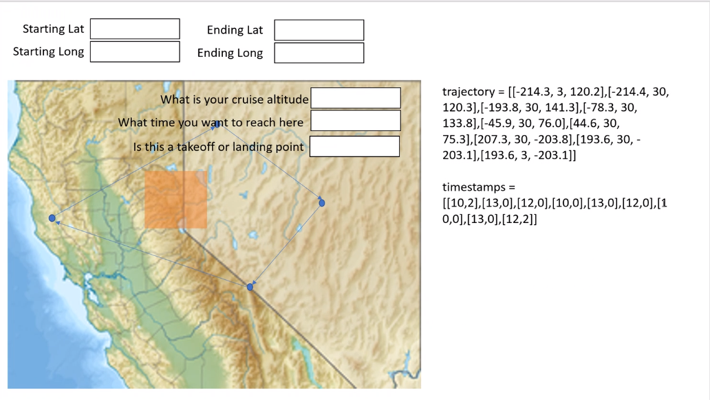

# Map_Based_Route_Calculation
Seek to create a program that allows the users to select points on a map then have a drone route between them generated.

## Version 0.1 - TKinter
  Successfully generated map file [here](map.html)
  
  Failed to open map in GUI using TKinter [here](archive/tkinter_version.py)

## Version 0.2 - PyQt5
  Successfully rendered map in GUI using PyQt5

## Version 0.3 - Window Split
  Tested adding second panel for input fields [here](archive/Split_test.py)

  Added functionality to main program [here](archive/markers_v0-3.py)

## Version 0.4 - Adding Markers
  Program now allows for adding points to map, save points as array of coordinates for future operations.

  See [here](archive/markers_v0-4.py)
